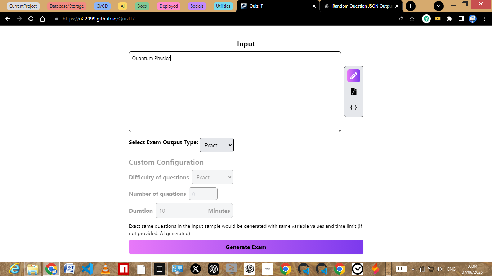
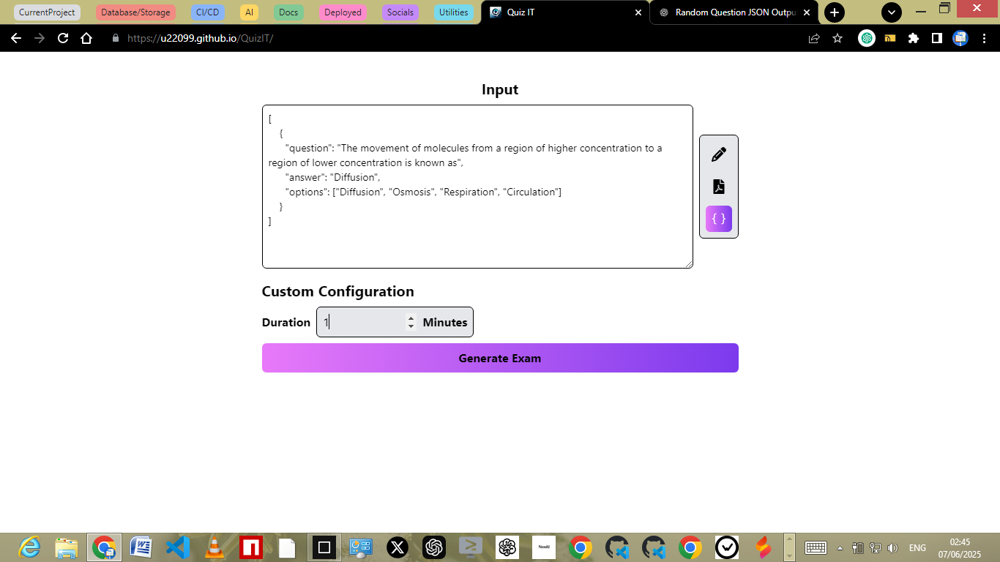
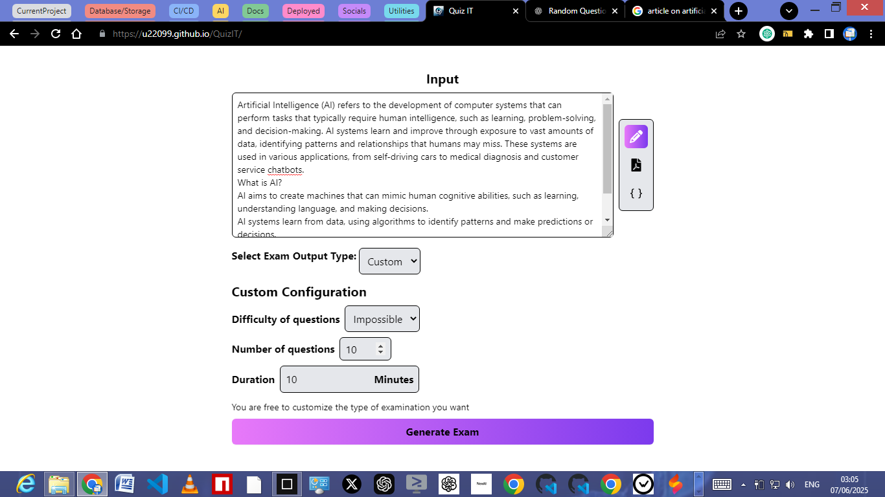
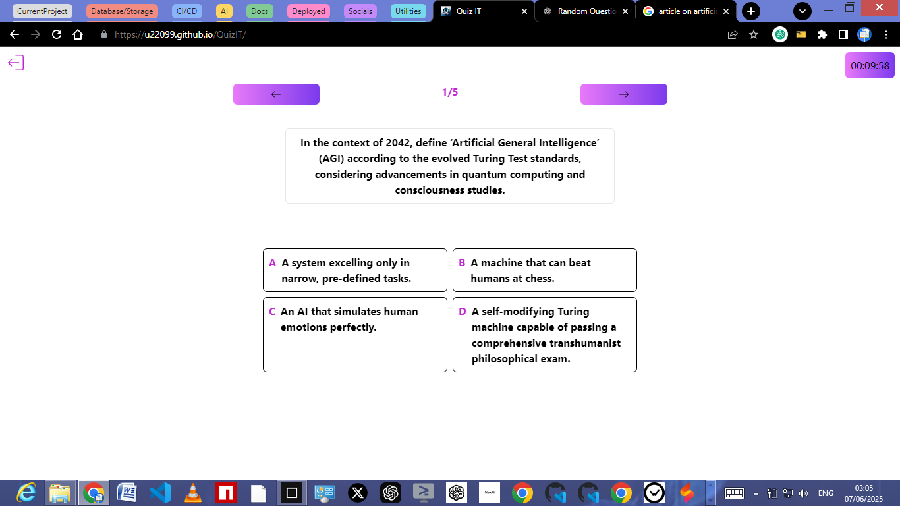
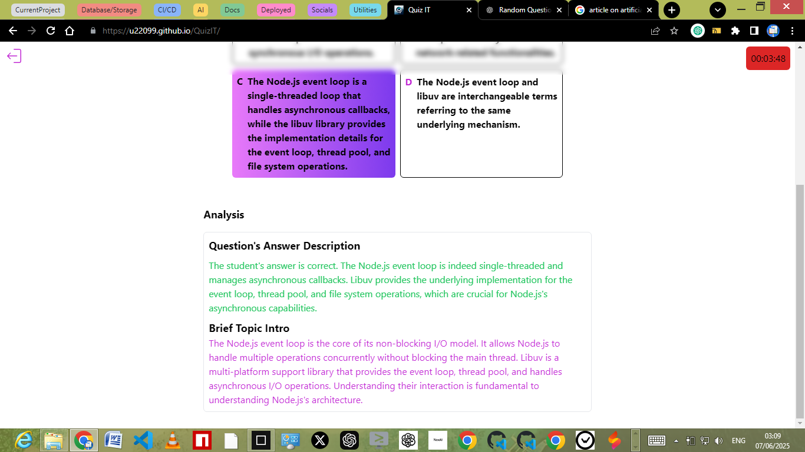

# 🧠 QuizIT: AI-Powered Exam Generator 🚀

Generate exams effortlessly with AI! QuizIT uses sample questions to create a digital exam environment with a timer and AI-calculated answers.

## ✨ Features

- 📝 **AI-Powered Question Generation:** Automatically generate questions based on your input.
- ⏱️ **Timed Exams:** Set time limits for realistic exam conditions.
- 📊 **AI-Calculated Answers:** Get AI-powered answer analysis and explanations.
- 📄 **Multi-Input Support**: Supports text, files (PDF, images), and JSON inputs.
- ⚙️ **Customizable Configurations**: Tailor exam difficulty, number of questions, and time.
- 🌙 **Dark Mode**: Eye-friendly dark mode for late-night studying.
- 📱 **PWA Support**: Installable as a Progressive Web App for offline access.

## 🛠️ Installation

Get started with QuizIT in a few simple steps:

- ⬇️ **Clone the Repository:**

  ```bash
  git clone https://github.com/U22099/QuizIT.git
  ```

- 📦 **Install Dependencies:**

  ```bash
  npm install
  ```

- 🚀 **Start the Development Server:**
  ```bash
  npm run dev
  ```

## 💻 Usage

1.  **Input Method**:

    - Choose your preferred input method: text, file (PDF, image), or JSON.
    <details>
    <summary>Example: Text Input</summary>
    
    


    Paste or type your sample question set, topic, or article into the text area.
    </details>
    <details>
    <summary>Example: JSON Input</summary>

    

    Use JSON to directly pass the questions in the format of { question: string; answer: string; options: string[] }[]
    </details>

2.  **Configure Exam Settings**:

    - Customize the exam type, difficulty, number of questions, and duration.
    <details>
    <summary>Example: Custom Configuration</summary>

    

    Adjust the difficulty and type using the custom configurations.
    </details>

3.  **Generate the Exam**:

    - Click the "Generate Exam" button to create your exam.

4.  **Take the Exam**:

    - Answer the questions within the given time limit.

    <details>
    <summary>Example: Exam View</summary>
    

    Navigate through the questions and select your answers.
    </details>

5.  **Review Results**:

    - Submit the exam and review your score and AI-powered analysis.

    <details>
    <summary>Example: Review</summary>
    

    Review results with AI generated insights.
    </details>

## 🧰 Technologies Used

| Technology       | Description                                                                        |
| :--------------- | :--------------------------------------------------------------------------------- |
| React            | Front-end library for building user interfaces                                     |
| TypeScript       | Superset of JavaScript that adds static typing                                     |
| Tailwind CSS     | Utility-first CSS framework for styling                                            |
| Vite             | Build tool that aims to provide a faster and leaner development experience         |
| Google Gemini AI | AI model used for exam generation and answer analysis                              |
| ESLint           | Tool for identifying and reporting on patterns found in ECMAScript/JavaScript code |
| Remarkable       | Markdown parser                                                                    |
| Highlight.js     | Syntax highlighter                                                                 |

## 🤝 Contributing

We welcome contributions to QuizIT! Here are some guidelines:

- 🐞 Report bugs and suggest improvements by opening issues.
- 🛠️ Submit pull requests with clear descriptions of your changes.
- 📝 Follow the existing code style and conventions.

## 📜 License

This project is licensed under the [MIT License](LICENSE).

## 🧑‍💻 Author Info

- **Author**: [U22099](https://github.com/U22099)
  - [GitHub](https://github.com/U22099/QuizIT)

[](https://www.npmjs.com/package/dokugen)
